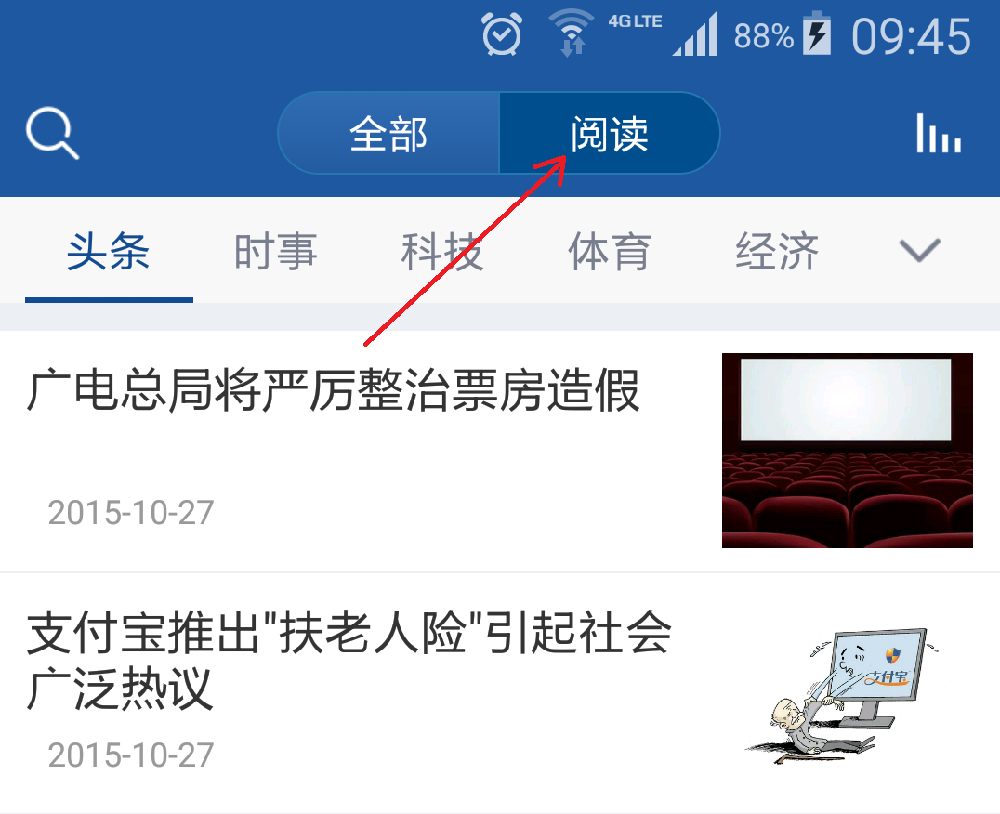

# 获取最新节目**单个**(全部-听-说-读)的读)
**效果图**    

<!--  -->


**JSON请求示例：**
```json
{
    "Token": "",
    "Params": {
        "PageIndex": 1,
        "PageSize": 1,
        "catid": 11012
    },
    "Method": "v9_news_getcolumnlist",
    "Terminal": 3,
    "Version": "1.0",
    "Lat": "100",
    "Lng": "444",
    "UID": 332940
} 
```

**JSON返回示例：**
```json
{
    "Code": 200,
    "Error": "",
    "Data": {
        "channel": "双语阅读",
        "data": [
            {
                "catname": "文学翻译",
                "catid": "14614",
                "lmpic": "http://pic.kekenet.com/column/201504/1430272214.jpg",
                "rank": "3",
                "title": "文学作品翻译:邹静之《割麦人》英文译文",
                "type": 2,
                "download": "诗歌翻译:杜荀鹤·《送人遊吴》英文译文",
                "updatetime": "2014-03-31",
                "thumb": "",
                "news_id": "283000"
            } 
        ]
    },
    "Token": "",
    "PageIndex": 1,
    "PageSize": 20,
    "PageCount": 1,
    "IsDecode": 0,
    "Key": ""
} 
```